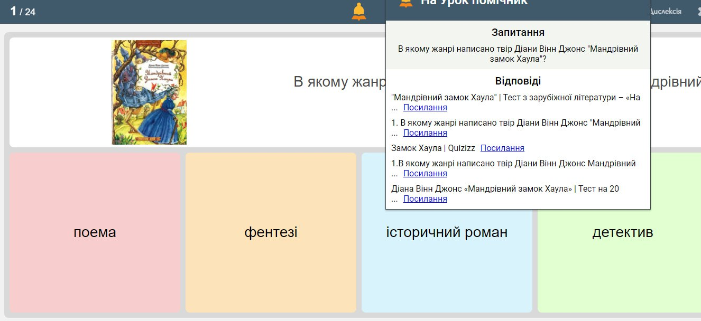
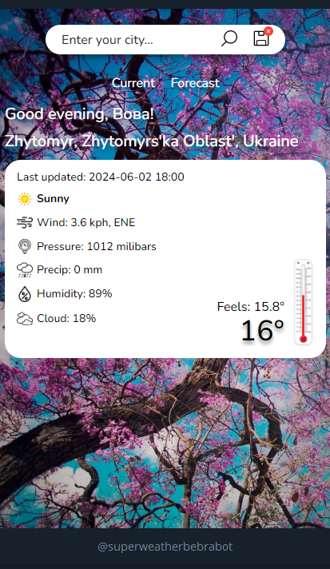
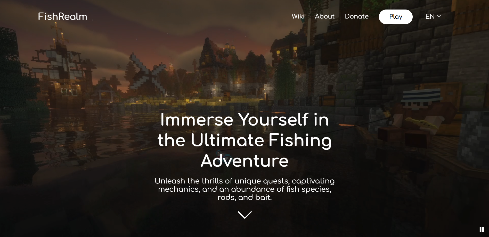
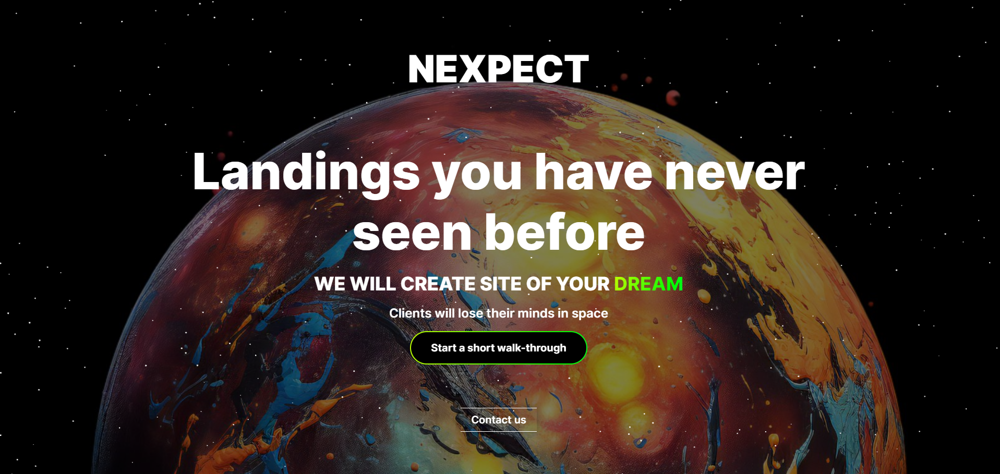
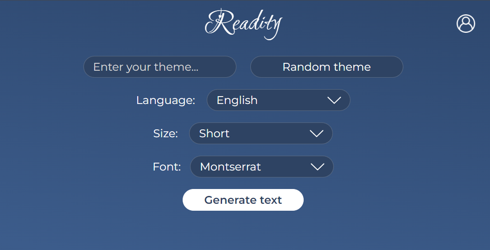
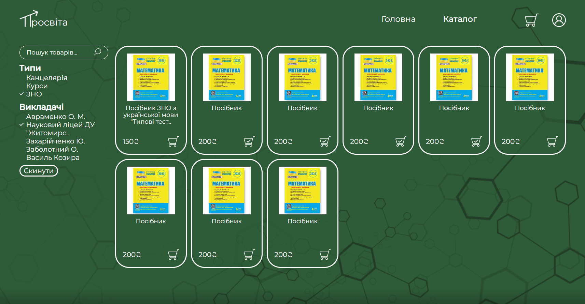
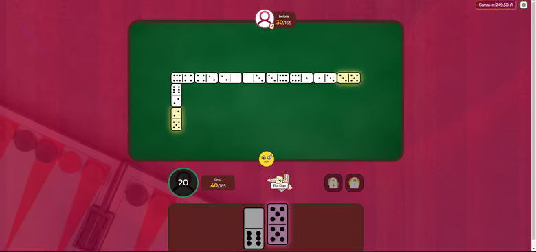
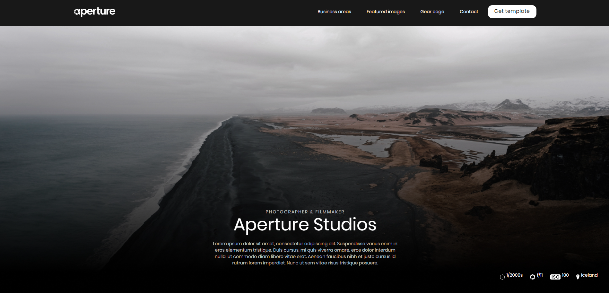
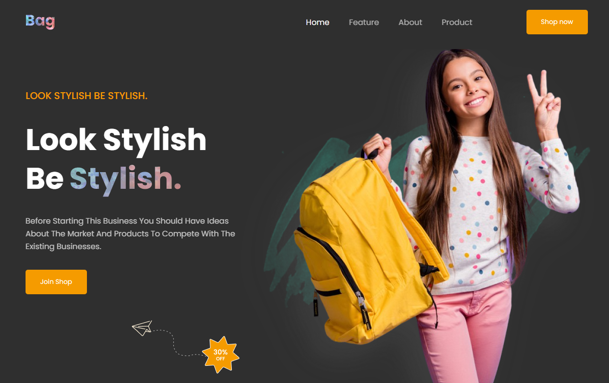

# My portfolio

### Browser extension to help in completing online tests [[TikTok]](https://www.tiktok.com/@naurok_pomichnyk) [[Telegram]](https://t.me/naur_p)
It went viral on TikTok among Ukrainian students. Got 100k+ views.
Extension was launched in private beta-test among telegram channel subscribers
who participated in referral system and giveaways.

Technologies:
- JavaScript
- Vite
- Google Custom Search Engine API
- Python
- Aiogram
- MongoDB

---

## React

### Weather app (Telegram mini app in bot) [[Link]](https://t.me/superweatherbebrabot) [[Github]](https://github.com/tweeedlex/weather-tg-miniapp-client) 
Web app inside telegram bot that shows weather based on user's location. 
Also there is forecast for 3 days.

Technologies:
  - React
  - Redux Toolkit
  - Sass
  - WeatherAPI
  - Swiper
  - Framer
  - Telegraf

---

  
### Minecraft server landing [[Link]](https://minefish.netlify.app/) [[Github]](https://github.com/tweeedlex/minefish)
Has a video on hero screen, localized in 2 languages.
  
Technologies:
  - React
  - Sass
  - I18N

---

### Web development studio landing [[Link]](https://nexpect.netlify.app/) [[Github]](https://github.com/tweeedlex/nexpect-client)
Has a lot of animations, interactivity and a 3D model that moves on scroll.

Technologies:
  - React
  - Sass
  - Framer motion
  - Three.js

---

## Full-Stack

### Reading speed tester [[Github]](https://github.com/tweeedlex/readity)
Generates text from OpenAI API with chosen settings and measures reading speed and comprehension.
Shows statistics for authorised users in profile via diagrams.

Technologies: 
  - React + MobX
  - Node.js + Express
  - MySQL + Sequelize
  - OpenAI API
  - Firebase Auth

---

### Online-store of educational goods [[Link]](https://prosvita.netlify.app/) [[Github]](https://github.com/tweeedlex/prosvita.git)
Landing page with basic information. Catalog with filters, search, pagination.
Each product has a detailed page with description, rating.
Users can add products to cart, make orders.
Includes admin panel to manage products, categories, orders.

Technologies:
  - React + MobX
  - Node.js + Express
  - MySQL + Sequelize
  - Firebase Auth
  - SMTP

---

### Multiplayer games site (Domino, Lotto) [[Link]](https://24loto.com/)
Each game has 5 rooms for each game mode. Domino can be played in 2 game modes and 
with different amount of players (2 and 4). 
Localization in 5 languages.
Has a different settings and features in profile.
Leaderboard with top players.
Each game has a waiting room and starts when all players are ready.
In domino users can share emojis and stickers.

Technologies:
  - JavaScript
  - Websockets
  - Node.js + Express
  - MySQL + Sequelize
  - JWT Auth

---

## HTML + CSS adaptive landings

### Business consultant [[Link]](https://tweeedlex.github.io/business-consultant-adaptive-landing/) [[Github]](https://github.com/tweeedlex/business-consultant-adaptive-landing)

---

- ### Photo studio [[Link]](https://serene-kangaroo-c93a88.netlify.app) [[Github]](https://github.com/tweeedlex/photo-studio-adaptive-landing)

---

- ### Bag shop [[Link]](https://chipper-stroopwafel-6cc031.netlify.app) [[Github]](https://github.com/tweeedlex/bag-adaptive-landing)
